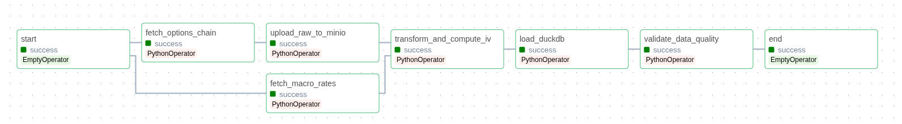
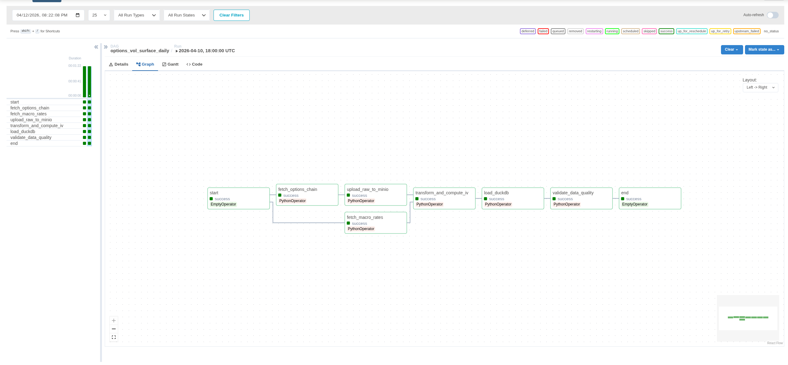
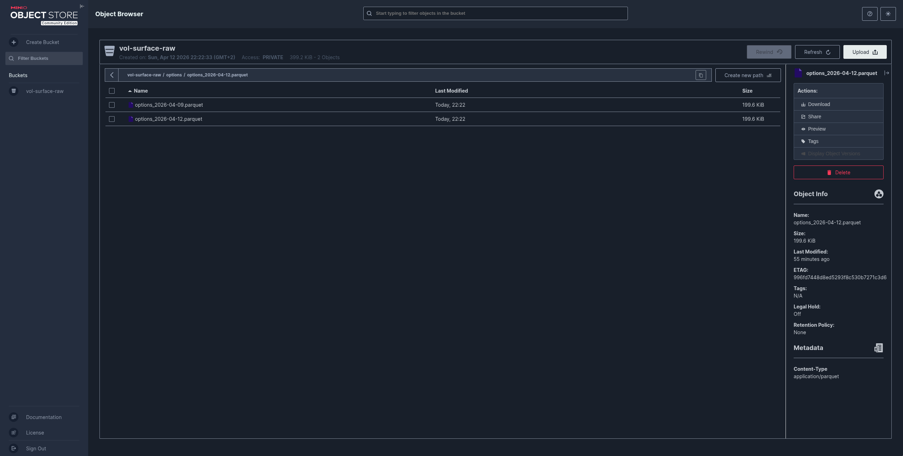
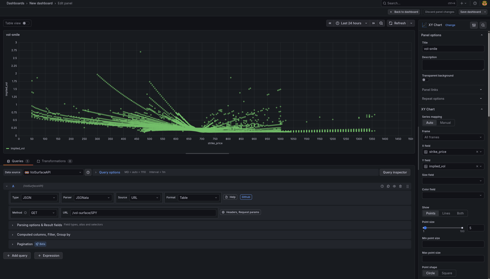

# Technikai dokumentáció — Equity Derivatives IV Surface Pipeline

---

## Tartalom

1. [Architektúra és indoklás](#1-architektúra-és-indoklás)
2. [Adatmodell — Csillag séma](#2-adatmodell--csillag-séma)
3. [Adatforrások](#3-adatforrások)
4. [Transzformációs pipeline](#4-transzformációs-pipeline)
5. [Orchestration](#5-orchestration)
6. [Adatkiszolgálás](#6-adatkiszolgálás)
7. [Infrastruktúra](#7-infrastruktúra)
8. [Pipeline futásának eredménye](#8-pipeline-futásának-eredménye)

---

## 1. Architektúra és indoklás

A pipeline hat logikai rétegre tagolódik: betöltés → nyers tárolás → transzformáció → adattárház → kiszolgálás → vizualizáció. A rétegek szándékosan lazán csatolt módon épülnek egymásra: bármelyik réteg cserélhető anélkül, hogy a többi módosítást igényelne.



### Eszközválasztás indoklása

**MinIO** — S3-kompatibilis objektumtároló a raw landing zone-hoz. Valós production környezetekben a nyers adatok objektumtárolóba kerülnek, nem fájlrendszerbe. A MinIO ezt lokálisan reprodukálja; AWS S3-ra történő migráció a connection string cseréjével elvégezhető.

**DuckDB** — analitikai adattárház. Beágyazott, szervermentes megoldás, natív Parquet-támogatással és gyors analitikai lekérdezésekkel. A csillag séma SQL-ben van definiálva FK-kapcsolatokkal. A séma minimális módosítással Snowflake-re vagy BigQuery-re portolható.

**Apache Airflow** — iparági standard orkesztrációs eszköz, DAG-alapú függőségkezeléssel, ütemezéssel és újrafuttathatósággal. A pipeline idempotens: ugyanazon `snapshot_date`-re való újrafuttatás törlés + újrainzertálással kezeli a duplikációt.

**FastAPI** — aszinkron Python REST framework. A quant/fintech környezetekben az analitikai adatokat jellemzően API-n keresztül fogyasztják a downstream rendszerek, nem közvetlen DB-kapcsolaton — ezt a mintát követi az architektúra.

**SciPy Brent-módszer** — Black-Scholes invertálása zárt formában nem lehetséges, ezért numerikus gyökkereső szükséges. A Brent-módszer garantáltan konvergál, ha a gyök az intervallumon belül van, és robusztusabb az alternatív Newton-Raphson módszernél, amely deep ITM/OTM opcióknál divergálhat.

---

## 2. Adatmodell — Csillag séma

```
                    ┌─────────────┐
                    │  dim_ticker │
                    │─────────────│
                    │ ticker_id PK│
                    │ symbol      │
                    │ sector      │
                    │ exchange    │
                    └──────┬──────┘
                           │
┌─────────────┐     ┌──────▼──────────────────┐     ┌─────────────┐
│  dim_expiry │     │  fact_options_snapshot  │     │  dim_strike │
│─────────────│     │─────────────────────────│     │─────────────│
│ expiry_id PK│◄────│ snapshot_id PK          │────►│ strike_id PK│
│ expiry_date │     │ ticker_id FK            │     │ strike_price│
│ days_to_exp │     │ expiry_id FK            │     │ moneyness   │
│ expiry_buck │     │ strike_id FK            │     └─────────────┘
└─────────────┘     │ option_type             │
                    │ implied_vol             │
                    │ last_price / mid_price  │
                    │ bid / ask               │
                    │ volume / open_interest  │
                    │ underlying_price        │
                    │ risk_free_rate          │
                    │ snapshot_date           │
                    └─────────────────────────┘
```

### Tervezési döntések

**Snapshot-alapú ténytábla:** a `fact_options_snapshot` napi pillanatképeket tartalmaz — minden futás egy új `snapshot_date` értéket szúr be, a korábbi napok megmaradnak. Ez teszi lehetővé az IV időbeli alakulásának elemzését.

**`dim_expiry` — előre számított mezők:** a `days_to_expiry` és `expiry_bucket` (near/mid/far) mezőket betöltéskor számítjuk ki, nem lekérdezéskor. Ez csökkenti a lekérdezési komplexitást és gyorsítja a term structure számítást.

**`dim_strike` — moneyness bucket:** az ITM/ATM/OTM besorolás az underlying árfolyamhoz viszonyítva, opciótípus-függően (call és put logikája tükrözött) kerül kiszámításra és tárolásra.

---

## 3. Adatforrások

### yfinance — opciós lánc

A yfinance könyvtár a Yahoo Finance API-t wrappolja. Minden futás lekéri az összes call és put opciót, az összes lejáratra és strike szintre, semi-strukturált JSON formátumban, amelyet Pandas DataFrame-mé konvertálunk.

Lekért mezők: `strike`, `expiry_date`, `lastPrice`, `bid`, `ask`, `volume`, `openInterest`  
Szimbólum: **SPY** (S&P 500 ETF) — a leglikvidebb opciós piac, stabil adatminőség.

### FRED API — kockázatmentes kamatláb

US 10 éves Treasury hozam (DGS10 sorozat) a Black-Scholes számításhoz. Ha az API nem elérhető, a pipeline konfigurálható fallback értékkel fut tovább (alapértelmezett: 4,5%).

---

## 4. Transzformációs pipeline

### Adattisztítás (`clean.py`)

- **Null kezelés:** hiányzó `strike`, `last_price` vagy `underlying_price` esetén a sor törlődik
- **Típuskonverzió:** minden numerikus mező `pd.to_numeric(..., errors='coerce')` hívással konvertálódik
- **Mid price:** `(bid + ask) / 2`, fallback `last_price` ha bid/ask nulla
- **Lejárt opciók:** `days_to_expiry <= 0` sorok törlődnek
- **Bucket hozzáadása:** moneyness és expiry bucket számítása

### Implied Volatility számítás (`iv_surface.py`)

A Black-Scholes egyenlet invertálása SciPy `brentq` gyökkereső algoritmussal, soronként:

1. **Intrinsic value check** — ha a piaci ár intrinsic value alatt van (arbitrázs), a sor törlődik
2. **Bracket check** — ha `[1e-6, 20.0]` intervallumon nincs gyök, a sor törlődik
3. **Brent-módszer** — garantált konvergencia
4. **Sanity filter** — 1% alatti vagy 500% feletti IV törlődik (valószínűleg hibás quote)

### Aggregáció

A `/term-structure` endpoint ATM opciókra átlagolja az IV értékeket `expiry_bucket` szinten — ez az iparági standard volatility term structure görbe.

---

## 5. Orchestration

Az `options_vol_surface_daily` DAG hétköznaponként 18:00 UTC-kor fut:



**Idempotencia:** a `load_duckdb` task futás előtt törli az adott `snapshot_date` fact sorait, majd újraszúrja — duplikáció nem keletkezik újrafuttatásnál.

**Validáció:** a `validate_data_quality` task ellenőrzi, hogy az IV számítás sikerességi aránya legalább 50%. Ha nem, a DAG run hibával zárul.

---

## 6. Adatkiszolgálás

### REST API végpontok

| Endpoint | Leírás |
|---|---|
| `GET /health` | Service és DB állapot |
| `GET /tickers` | Elérhető szimbólumok listája |
| `GET /vol-surface/{ticker}` | Teljes IV felület |
| `GET /term-structure/{ticker}` | ATM IV lejárat szerint |
| `GET /vol-smile/{ticker}/{expiry}` | Vol smile egy lejáratra |
| `GET /snapshots/{ticker}` | Elérhető snapshot dátumok |

Opcionális query paraméter: `?snapshot_date=ÉÉÉÉ-HH-NN`

### Grafana dashboard

Az Infinity datasource a FastAPI endpointokat kérdezi le közvetlenül. Három panel:

- **Vol Smile** — IV strike függvényében (XY chart)
- **Term Structure** — ATM IV expiry bucket szerint (bar chart)
- **IV Surface heatmap** — moneyness vs expiry bucket, szín = IV érték

### Analitikai lekérdezések (`queries/`)

**ATM vol idősor** (`atm_vol_timeseries.sql`)
```sql
SELECT
    f.snapshot_date,
    dt.symbol,
    AVG(f.implied_vol) AS atm_iv
FROM fact_options_snapshot f
JOIN dim_ticker dt ON f.ticker_id = dt.ticker_id
JOIN dim_strike ds ON f.strike_id = ds.strike_id
WHERE ds.moneyness_bucket = 'ATM'
  AND f.implied_vol IS NOT NULL
GROUP BY f.snapshot_date, dt.symbol
ORDER BY f.snapshot_date, dt.symbol;
```

**Vol smile** (`vol_smile.sql`)
```sql
SELECT
    ds.strike_price,
    ds.moneyness_bucket,
    f.option_type,
    f.implied_vol,
    f.bid,
    f.ask
FROM fact_options_snapshot f
JOIN dim_ticker dt ON f.ticker_id = dt.ticker_id
JOIN dim_strike ds ON f.strike_id = ds.strike_id
JOIN dim_expiry de ON f.expiry_id = de.expiry_id
WHERE dt.symbol = 'SPY'
  AND de.expiry_date = '2026-04-17'
  AND f.snapshot_date = '2026-04-12'
  AND f.implied_vol IS NOT NULL
ORDER BY ds.strike_price;
```

**Cross-ticker összehasonlítás** (`cross_ticker_comparison.sql`)
```sql
SELECT
    dt.symbol,
    de.expiry_bucket,
    AVG(f.implied_vol) AS avg_iv,
    MIN(f.implied_vol) AS min_iv,
    MAX(f.implied_vol) AS max_iv
FROM fact_options_snapshot f
JOIN dim_ticker dt ON f.ticker_id = dt.ticker_id
JOIN dim_strike ds ON f.strike_id = ds.strike_id
JOIN dim_expiry de ON f.expiry_id = de.expiry_id
WHERE ds.moneyness_bucket = 'ATM'
  AND f.implied_vol IS NOT NULL
  AND f.snapshot_date = (SELECT MAX(snapshot_date) FROM fact_options_snapshot)
GROUP BY dt.symbol, de.expiry_bucket
ORDER BY dt.symbol, de.expiry_bucket;
```

**Term structure** (`term_structure.sql`)
```sql
SELECT
    de.expiry_bucket,
    de.days_to_expiry,
    de.expiry_date,
    AVG(f.implied_vol) AS avg_atm_iv
FROM fact_options_snapshot f
JOIN dim_ticker dt ON f.ticker_id = dt.ticker_id
JOIN dim_strike ds ON f.strike_id = ds.strike_id
JOIN dim_expiry de ON f.expiry_id = de.expiry_id
WHERE dt.symbol = 'SPY'
  AND ds.moneyness_bucket = 'ATM'
  AND f.implied_vol IS NOT NULL
  AND f.snapshot_date = (SELECT MAX(snapshot_date) FROM fact_options_snapshot)
GROUP BY de.expiry_bucket, de.days_to_expiry, de.expiry_date
ORDER BY de.days_to_expiry;
```

---

## 7. Infrastruktúra

A teljes környezet egyetlen paranccsal indítható (`docker compose build && docker compose up -d`). Négy service fut Docker Compose alatt:

| Service | Image | Feladat |
|---|---|---|
| `airflow` | custom (apache/airflow:2.8.1) | Orchestration |
| `minio` | minio/minio:latest | Raw landing zone |
| `fastapi` | custom (python:3.11-slim) | REST API |
| `grafana` | grafana/grafana:latest | Dashboard |

A DuckDB fájl Docker volume-on él (`duckdb_data`) — az adatok persistensek container újraindítások között. Minden konfiguráció `.env` fájlból olvasódik, nincs hardcoded érték a forráskódban.



---

## 8. Pipeline futásának eredménye

A pipeline két egymást követő napon futott sikeresen (`2026-04-09`, `2026-04-12`). A DuckDB adattárház **16 264 sort** tartalmaz, a FastAPI health endpoint `{"status": "healthy", "db": "connected"}` választ ad.

A Grafana vol smile panel a SPY IV felületet ábrázolja strike függvényében — a jellegzetes volatility skew jól látható: az alacsonyabb strike-okon magasabb az IV (put skew), ami megfelel az opciópiaci konvenciónak.


